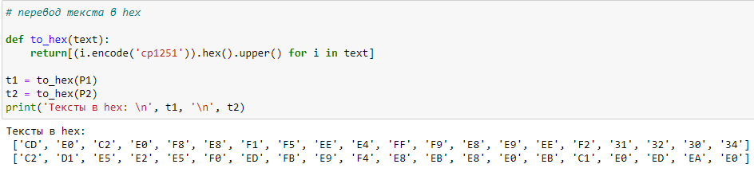
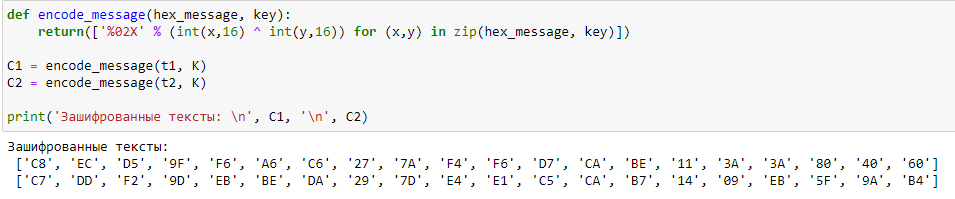
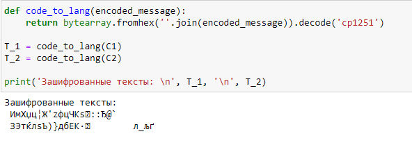

# Презентация к лабораторной работе 8.
## Элементы криптографии. Шифрование (кодирование) различных исходных текстов одним ключом

## Выполнила студентка группы НФИбд-02-19: Комарова Ирина Сргеевна 1032192866

## Задание
    Освоить на практике применение режима однократного гаммирования на примере  кодирования различных исходных текстов одним ключом.

## Ход работы.
1.  Заполнила исходные данные.

2. Перевела текст в формат hex и вывела.

3. Зашифровала надписи.

4. Попробовала расшифровать и вывела текст.

5. Вывела текст немного в другом формате.

6. Написала функцию, которая ищет второй текст по первому и наоборот.

## Вывод 
    Я освоила на практике применение режима однократного гаммирования на примере кодирования различных исходных текстов одним ключом.

## Библиография
1. Методические материалы курса. “Информационная безопасность компьютерных сетей” Кулябов Д. С.,Королькова А. В., Геворкян М. Н.